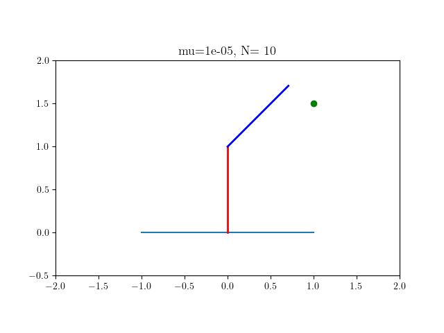

# Tuning MPC is difficult


### Objective function A


### Objective function B

$$
l^\text{B} (\mathbf{x}_k,\mathbf{u}_k)
=
\begin{bmatrix} 
    {\mathbf{e}}(\mathbf{x}_k) \\ \dot{\mathbf{e}}(\mathbf{x}_k)
\end{bmatrix}^\intercal
\mathbf{Q}^\text{B}
\begin{bmatrix} 
    {\mathbf{e}}(\mathbf{x}_k) \\ \dot{\mathbf{e}}(\mathbf{x}_k)
\end{bmatrix}
+ \mathbf{u}_k^\intercal \mathbf{R} \mathbf{u}_k.
$$


### Objective function C - Proposed approach

### Objective function C - With constraints

<div align="center">
    
</div>

## Installation

Install fatrop with spectool 
- Instructions are available [here](https://github.com/meco-group/fatrop/blob/main/compilation_instructions.md)
- This involves 
    - (1) Creating a virtual environment
    - (2) Install Casadi from source
    - (3) Install Fatrop with Spectool 
    
Install this package with
```
pip install -e .
```

## Running the code

## Contents

### Controllers

### Environments