# From Instantaneous to Predictive Control: A More Intuitive and Tunable MPC Formulation for Robot Manipulators
This repository is intended to accomany the paper "From Instantaneous to Predictive Control: A More Intuitive and Tunable MPC Formulation for Robot Manipulators", submitted to RA-L. In particular, it containts the source code for the motivation example used throughout the paper, as well as some additional animations to better illustrate the main points.

[](https://www.youtube.com/watch?v=do_SWGdcBRU)

## Motivating example

We consider solving the following optimal control problem (OCP) at every control interval of the model predictive controller (MPC):
```math
        \begin{align*} 
                \min_{\mathbf{u}, \mathbf{x}} \, \, & 
                \sum_{k=0}^{N-1} l(\mathbf{x}_k,\mathbf{u}_k) \,\, + V_N(\mathbf{x}_N)
                \\
                \textrm{s.t.} \quad
                & \mathbf{x}_{k+1} = \mathbf{f}_d(\mathbf{x}_k, \mathbf{u}_k).
        \end{align*}
```
To motivate the challenge of tuning the MPC controller, we compare three different objective functions. For all three objective functions, the terminal cost $V_N$ is set to zero, and the stage cost $l(\mathbf{x}_k,\mathbf{u}_k)$ is modified.

### Objective function A

```math
l^\text{A} (\mathbf{x}_k,\mathbf{u}_k)
=
\mathbf{e}(\mathbf{x}_k)^\intercal \mathbf{Q} \mathbf{e}(\mathbf{x}_k) + \mathbf{u}_k^\intercal \mathbf{R} \mathbf{u}_k.
```

For this objective function, the weighting matrices are chosen as $\mathbf{Q} = \mathbf{I}$ and $\mathbf{R} = \mu \mathbf{I}$, where $\mathbf{I}$ is an identity matrix and $\mu$ adjusts the level of regularisation. The resulting closed-loop performance for a horizon length of $N = 50$ and different values of $\mu$ is visualised below:

<div align="center">
    
    <!--  -->
    <!-- 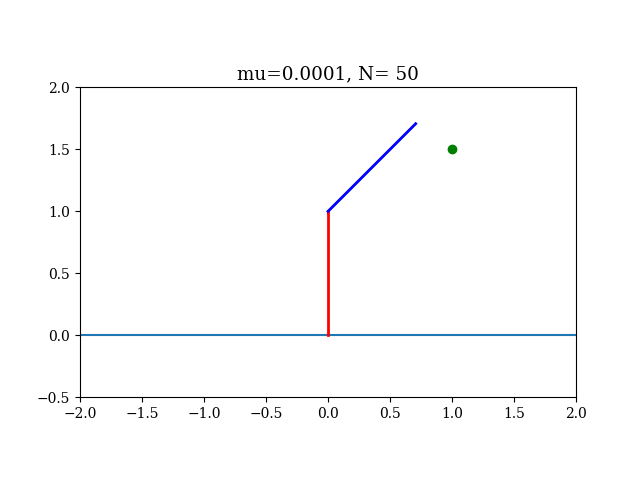 -->
    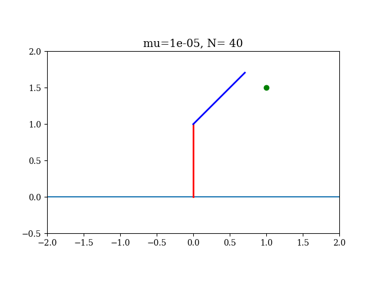
</div>

Clearly, for smaller values of $\mu$, the performance improves. This can be seen quantitatively in the following graph:

<div align="center">
    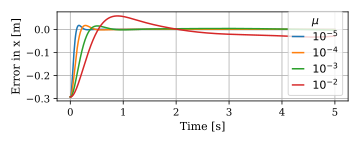
</div>

However, this simulation used the same model as the MPC controller, without any mismatch.
A more realistic scenario can be achieved by modifying the simulation to include a first-order model for the actuator dynamics.
The results of repeating the previous experiment, but now with the actuator dynamics included, can be seen below.
Introducing the actuator dynamics causes the very fast response ($\mu = 10^{-5}$) to become unstable, whereas the slower responses are less affected by the mismatch.

<div align="center">
    
    <!--  -->
    <!-- 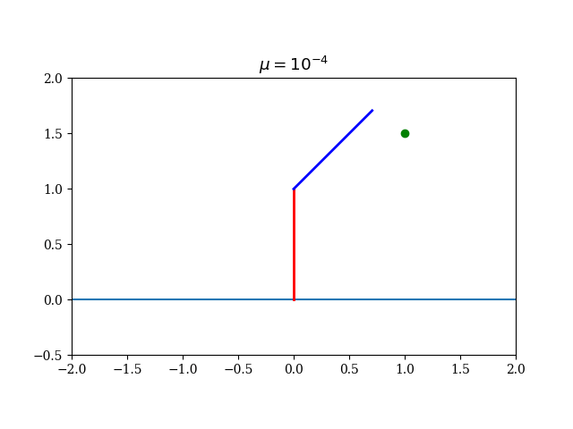 -->
    
</div>

The quantitative results for this experiement can be found below, showing the unstable response for $\mu = 10^{-5}$:

<div align="center">
    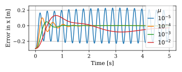
</div>

### Objective function B

```math
l^\text{B} (\mathbf{x}_k,\mathbf{u}_k)
=
\begin{bmatrix} 
    {\mathbf{e}}(\mathbf{x}_k) \\ \dot{\mathbf{e}}(\mathbf{x}_k)
\end{bmatrix}^\intercal
\mathbf{Q}^\text{B}
\begin{bmatrix} 
    {\mathbf{e}}(\mathbf{x}_k) \\ \dot{\mathbf{e}}(\mathbf{x}_k)
\end{bmatrix}
+ \mathbf{u}_k^\intercal \mathbf{R} \mathbf{u}_k.
```

Objective function B introduces a penalty on the time-derivative of the task error, $\dot{\mathbf{e}}$. The weighting matrices for this objective function are chosen as $\mathbf{Q}^\text{B} = \text{diag}(\mathbf{I}, \lambda \mathbf{I})$ and $\mathbf{R} = \mu \mathbf{I}$, where $\lambda$ adjusts the regularisation of the error velocity. 
The controller was hand tuned for values of $\mu = 10^{-4}$, $\lambda = 10^{-1}$, and $N=30$ to achieve a stable response with small tracking error. Following this, experiments were performed to evaluate the impact of different horizon lengths.

<div align="center">
    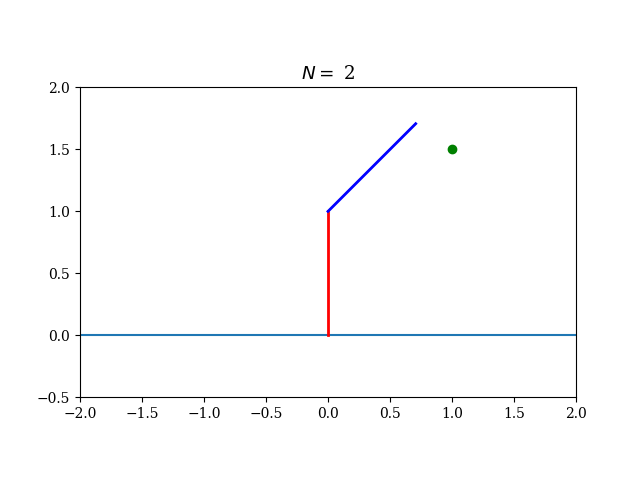
    <!--  -->
    <!-- 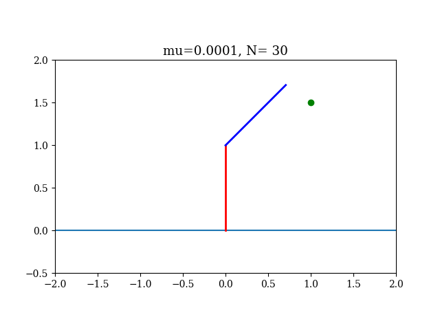 -->
    
</div>

Clearly, the performance significantly depends on the horizon length. More specifically, the performance improves as the horizon length increases, with poor performance for a short horizon length.

<div align="center">
    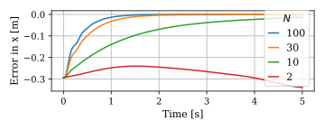
</div>


### Objective function C - Proposed approach
The purpose of this objective function is to achieve a closed-loop performance that is less dependant on the horizon length. In particular, it is desireable that the performance should be good even for a short horizon length. This can be achieved by penalising the deviation of the error from a first-order response, as opposed to penalising the error directly.

$$
\boldsymbol{\varepsilon}(\mathbf{x},\mathbf{u}) = \dot{\mathbf{e}}(\mathbf{x}, \mathbf{u}) + \mathbf{K}_e \mathbf{e}(\mathbf{x}) 
$$
$$
l^\text{c}(\mathbf{x}_k,\mathbf{u}_k) = {\boldsymbol{\varepsilon}}(\mathbf{x}_k, \mathbf{u}_k)^\intercal \mathbf{W}_s {\boldsymbol{\varepsilon}}(\mathbf{x}_k, \mathbf{u}_k) + \mu \mathbf{u}_k^\intercal \mathbf{W}_r \mathbf{u}_k.
$$

In fact, this is the same as using objective function B, but with the following weighting matrices:
```math
    \mathbf{Q}^\textrm{B} = 
    \begin{bmatrix}
    \mathbf{K}_e^\intercal \mathbf{W}_s \mathbf{K}_e & \mathbf{K}_e^\intercal \mathbf{W}_s \\
    \mathbf{W}_s \mathbf{K}_e & \mathbf{W}_s
    \end{bmatrix}, \quad
    \mathbf{R} = \mu \mathbf{W}_r.
```
Therefore, this approach can simply be viewed as a way of choosing $\mathbf{Q}^\text{b}$ and $\mathbf{R}$ with a specific structure. As can be seen in the experiments below, this objective function appears to be invariant with respect to the horizon length, and also gives good performance even with a very short horizon.

<div align="center">
    
    <!--  -->
    <!--  -->
    
</div>

<div align="center">
    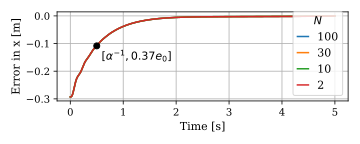
</div>

### Objective function C - With constraints
Previously it was shown that using objective function C, the same closed-loop performance can be achieved for a wide range of horizon lengths. This begs the question, why have a long horizon length, if it gives the same performance as for a short horizon length? The answer to this question can be found by modifing the problem formulation to include constraints on the joint positions, velocities and accelerations. When these constraints are present, it can be seen that the closed-loop performance improves as the horizon length increases. The reason for this is that the longer prediction horizon allows the MPC controller to better anticipate and avoid constraint violations. The results of the experiments with the added constraints are visualised below.


<div align="center">
    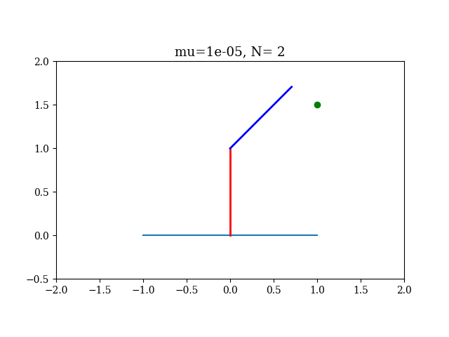
    <!-- 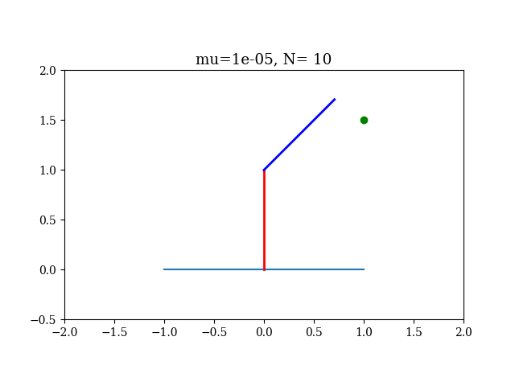 -->
    <!--  -->
    
</div>

<div align="center">
    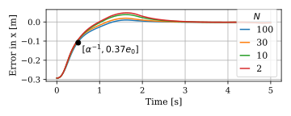
</div>

## Installation


### Option 1 : Devcontainer and Docker

- Make use of the provided devcontainer and docker file. To do this, it is nescessary to install vscode, docker and the vscode devcontainer extension. Instructions on getting started with devcontainers are available [here](https://code.visualstudio.com/docs/devcontainers/tutorial).
- Once vscode and docker is successfully installed, open vscode in the root directory of this project.
  ```
  code .
  ```
- Visual studio will ask you to open the workspace in a container.  Say YES.  If you don't get the message, you can press "F1" (or ctrl-shift P) and look for "Reopen in Container".  Make sure that you opened the workspace in the directory of the tuning_mpc repository.
- The first time the Docker image will be created.  This will take some time (download of a base image and compiling the dependencies).  The next time that you start, the container will start in a few seconds.  


### Option 2 : Source install

- The MPC controller requires Casadi and Fatrop (with the spectool specification) installed from source. Instructions are available [here](https://github.com/meco-group/fatrop/blob/main/compilation_instructions.md) and involves (1) Creating a virtual environment; (2) Install Casadi from source; (3) Install Fatrop with Spectool.
- Once casadi and fatrop is installed, install the additional requirements
  ```
  pip install -r requirements.txt && pip install -e .
  ```
    
## Running the code

Running the following command reproduces all the graphs presented in the paper
```
python paper_experiments.py
```
The resulting figures are stored in the "figures" directory, and the animations in the "animation" directory.
