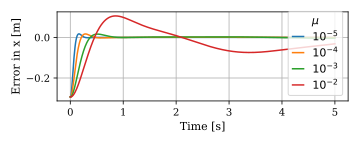

# Tuning MPC is difficult
We consider solving the following optimal control problem (OCP) at every control interval of the model predictive controller (MPC):
$$
        \begin{align*} 
                \min_{\mathbf{u}, \mathbf{x}} \, \, & 
                \sum_{k=0}^{N-1} l(\mathbf{x}_k,\mathbf{u}_k) \,\, + V_N(\mathbf{x}_N)
                \\
                \text{s.t.} \quad
                & \mathbf{x}_{k+1} = \mathbf{f}_d(\mathbf{x}_k, \mathbf{u}_k).
        \end{align*}
$$
To motivate the challenge of tuning the MPC controller, we compare three different objective functions. For all three objective functions, the terminal cost $V_N$ is set to zero, and the stage cost $l(\mathbf{x}_k,\mathbf{u}_k)$ is modified.

### Objective function A

$$
l^\text{A} (\mathbf{x}_k,\mathbf{u}_k)
=
\mathbf{e}(\mathbf{x}_k)^\intercal \mathbf{Q} \mathbf{e}(\mathbf{x}_k) + \mathbf{u}_k^\intercal \mathbf{R} \mathbf{u}_k.
$$

For this obejective function, the weighting matrices are chosen as $\mathbf{Q} = \mathbf{I}$ and $\mathbf{R} = \mu \mathbf{I}$, where $\mathbf{I}$ is an identity matrix and $\mu$ adjusts the level of regularisation. The resulting closed-loop performance for a horizon length of 50 and different values of $\mu$ is visualised below:

<div align="center">
    
    
    
    
</div>

Clearly, for smaller values of $\mu$, the performance improves. This can be seen in quantitatively in the following graph:

<div align="center">
    
</div>


<div align="center">
    
    
    
    
</div>

<div align="center">
    
</div>

### Objective function B

$$
l^\text{B} (\mathbf{x}_k,\mathbf{u}_k)
=
\begin{bmatrix} 
    {\mathbf{e}}(\mathbf{x}_k) \\ \dot{\mathbf{e}}(\mathbf{x}_k)
\end{bmatrix}^\intercal
\mathbf{Q}^\text{B}
\begin{bmatrix} 
    {\mathbf{e}}(\mathbf{x}_k) \\ \dot{\mathbf{e}}(\mathbf{x}_k)
\end{bmatrix}
+ \mathbf{u}_k^\intercal \mathbf{R} \mathbf{u}_k.
$$

<div align="center">
    
</div>


### Objective function C - Proposed approach
$$
\boldsymbol{\varepsilon}(\mathbf{x},\mathbf{u}) = \dot{\mathbf{e}}(\mathbf{x}, \mathbf{u}) + \alpha \mathbf{e}(\mathbf{x}) 
$$
$$
l^\text{c}(\mathbf{x}_k,\mathbf{u}_k) = {\boldsymbol{\varepsilon}}(\mathbf{x}_k, \mathbf{u}_k)^\intercal \mathbf{W}_s {\boldsymbol{\varepsilon}}(\mathbf{x}_k, \mathbf{u}_k) + \mu \mathbf{u}_k^\intercal \mathbf{W}_r \mathbf{u}_k.
$$

<div align="center">
    
</div>

### Objective function C - With constraints

<div align="center">
    
</div>

## Installation

Install fatrop with spectool 
- Instructions are available [here](https://github.com/meco-group/fatrop/blob/main/compilation_instructions.md)
- This involves 
    - (1) Creating a virtual environment
    - (2) Install Casadi from source
    - (3) Install Fatrop with Spectool 
    
Install this package with
```
pip install -e .
```

## Running the code

## Contents

### Controllers

### Environments